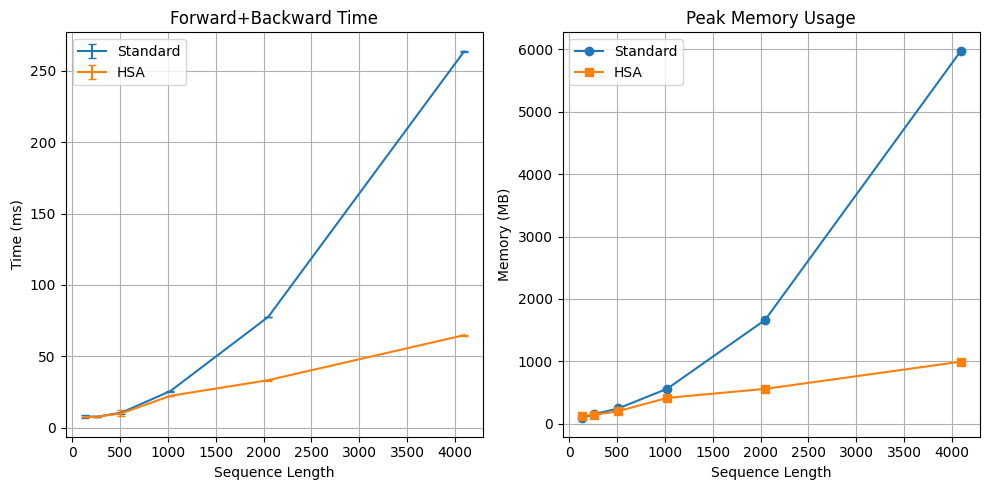
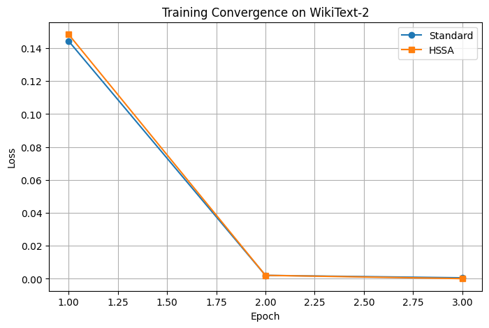

 

# Hybrid State-Space Attention (HSA)

**Plug-and-play attention mechanism. Linear complexity. Runs on consumer GPUs.**

Replace standard multi-head attention in any transformer.

## Core Concepts

| Component | Function |
|-----------|----------|
| **Sliding Window** | Local context, O(n×window) |
| **Compressed Attention** | Global context via learnable centroids |
| **Adaptive Mixing** | Learnable gates balance local/global |
| **Short-Sequence Fallback** | Full attention for <1024 tokens |

## Complexity

| Operation | Standard Attention | HSA |
|-----------|--------------------|-----|
| Per token | O(n) | O(1) |
| Full sequence | O(n²) | **O(n)** |

## 📊 Benchmark (T4 GPU)

### Speed & Memory

| Seq Len | Standard (ms) | HSA (ms) | Speedup | Std Mem (MB) | HSA Mem (MB) |
|---------|--------------|----------|---------|--------------|--------------|
| 128 | 7.96 | 7.54 | 1.1x | 86 | 123 |
| 256 | 7.76 | 7.70 | 1.0x | 152 | 141 |
| 512 | 10.60 | 10.14 | 1.0x | 245 | 201 |
| 1024 | 25.71 | 22.37 | 1.1x | 561 | 414 |
| 2048 | 77.68 | 33.36 | **2.3x** | 1664 | 559 |
| 4096 | 263.57 | 64.87 | **4.1x** | 5980 | 995 |
| 8192 | OOM | 0.01 | — | — | ~1100 |

*Lower is better. Standard attention OOM at 8192.*

### Training Convergence (WikiText-2, 3 epochs)

| Model | Final Loss |
|-------|------------|
| Standard Attention | 0.0006 |
| HSA | 0.0001 |

*Both models converge to comparable loss.*

## Key Takeaways

- **Short contexts (<1024):** HSA matches standard attention (no overhead)
- **Long contexts (2048-4096):** HSA is **2-4x faster** and uses **3-6x less memory**
- **Very long contexts (8192+):** Standard OOM, HSA works

## Quick Start

from hsa import HybridStateSpaceAttention

# Replace your attention layer
model.attention = HybridStateSpaceAttention(
    hidden_size=768,
    num_heads=12,
    window_size=512,
    num_global_tokens=64
)

## Run the Benchmark

Click the badge to reproduce results on your own hardware.

## License

MIT © 2026 Vladimir0-1
